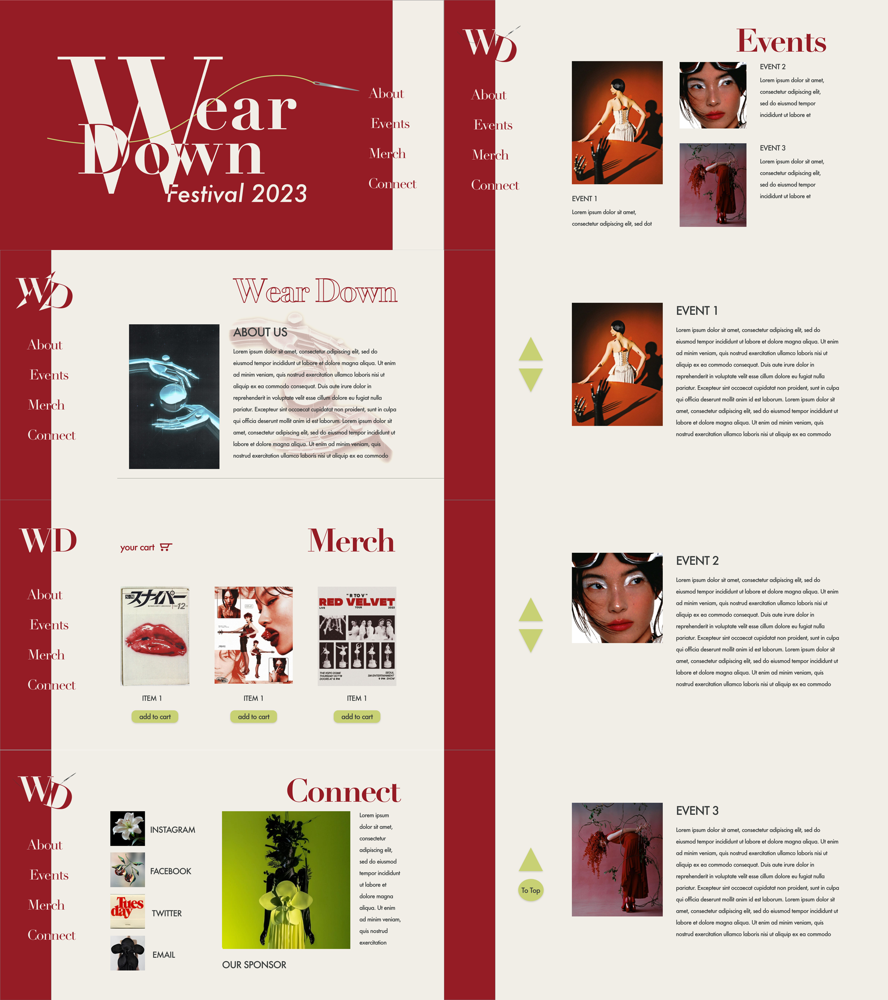

# Wear Down
by Kimberly Nguyen,
December 2023

# Project Overview
Fashion sustainability is an issue at the current forefront of the industry. The fashion industry is one of the largest industrial polluters due to its excessive amounts of textile waste along with its unsustainable water usage and contamination. The industry is also infamous for its constant unfair and exploitative labor practices. 

This website creates a fictional festival aimed at educating the average consumer in the pollutive and inhumane practices of the fashion industry, along with what to look for when attemting to avoid and substitute fast fashion clothing. Everyone buys and wears clothes, therefore, this issue is related to everyone, even if they are not interested in fashion or style. 

"Green-washing" is also a new industry trend wherein a fast fashion brand misleadingly advertises itself as ethical and sustainable without any transparancy with its practices. FOr example, this can be seen with brands starting clothing recycling campaigns while still unethically overproducing clothing and not diclosing where and how they are actually recycling the clothes. Consumers should be given the tools to discern corporate deceptions to make better buying decisions.

Consumer profits are what drive large corporations to continue these practices, so making more consumers aware of the issue and where to find alternatives is essential to the fashion sustainability movement.

# Technical Overview
This site was coded in HTML and CSS using Visual Studio Code, and utilized a Github server.

The Wear Down logo, navigation text, tickets, and various icons were created using Adobe Illustrator.

The wireframe was created using Adobe XD (linked down below).

Images were edited using Adobe Photoshop

Styling of the site was inspired by Vogue branding along with themes of retrofuturism.

Fonts used (Adobe)
* Didot
* Futura

 

# Acknowledgements
overflow: https://www.w3schools.com/css/css_overflow.asp

border radius: https://developer.mozilla.org/en-US/docs/Web/CSS/border-radius

hover overlay: https://youtu.be/hr4JiDr7Aec?si=AdYeGDb-tyzLYzo0

# Wireframe

https://xd.adobe.com/view/4689fd62-56bf-4ecf-bac0-01b1465ee26d-13da/ 